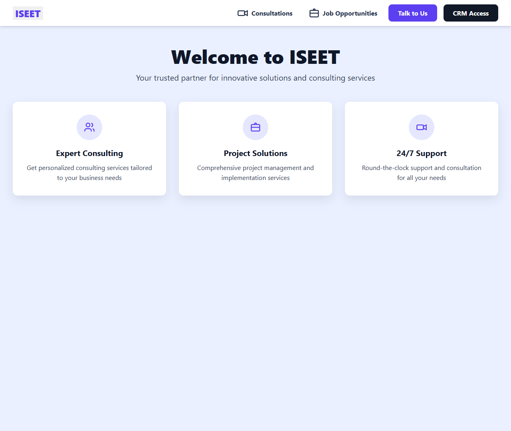
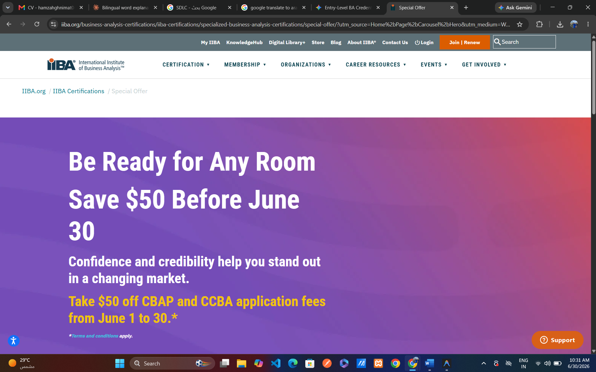
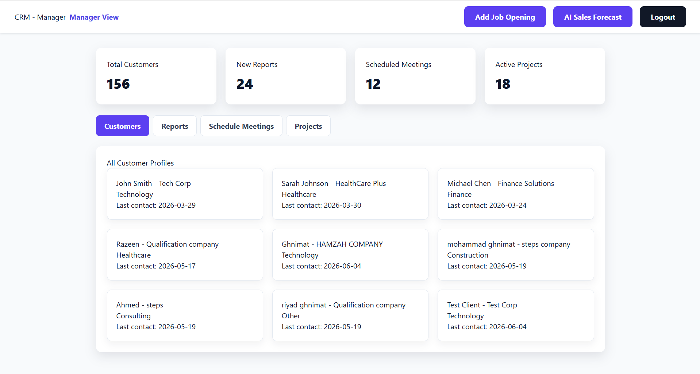
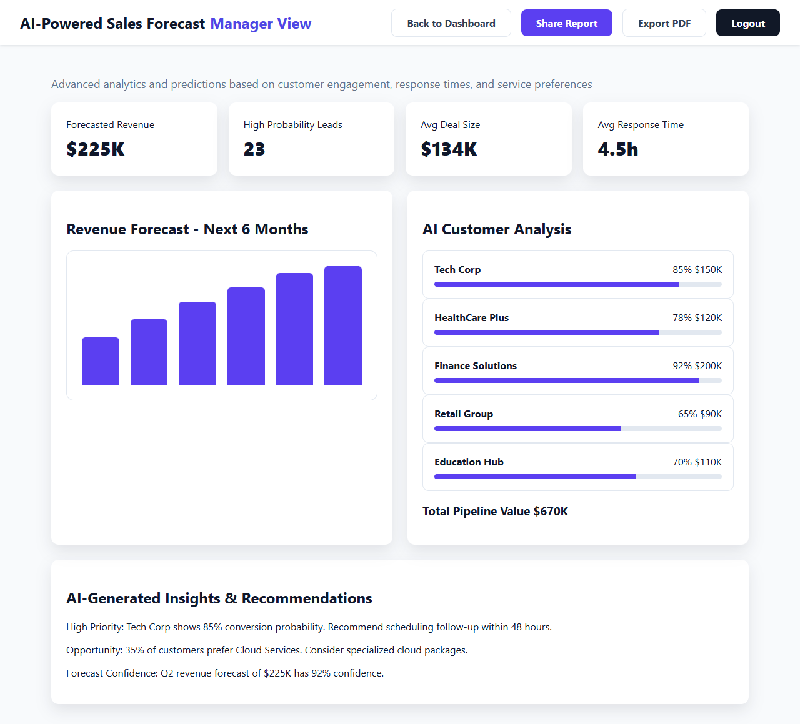
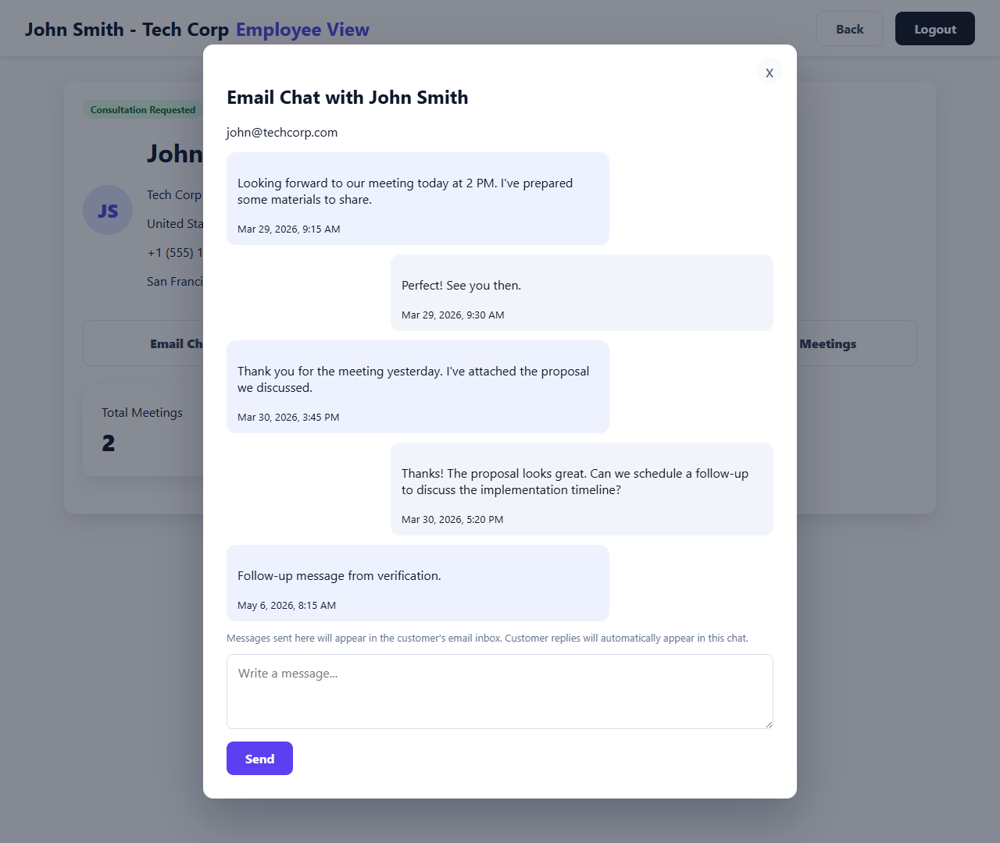
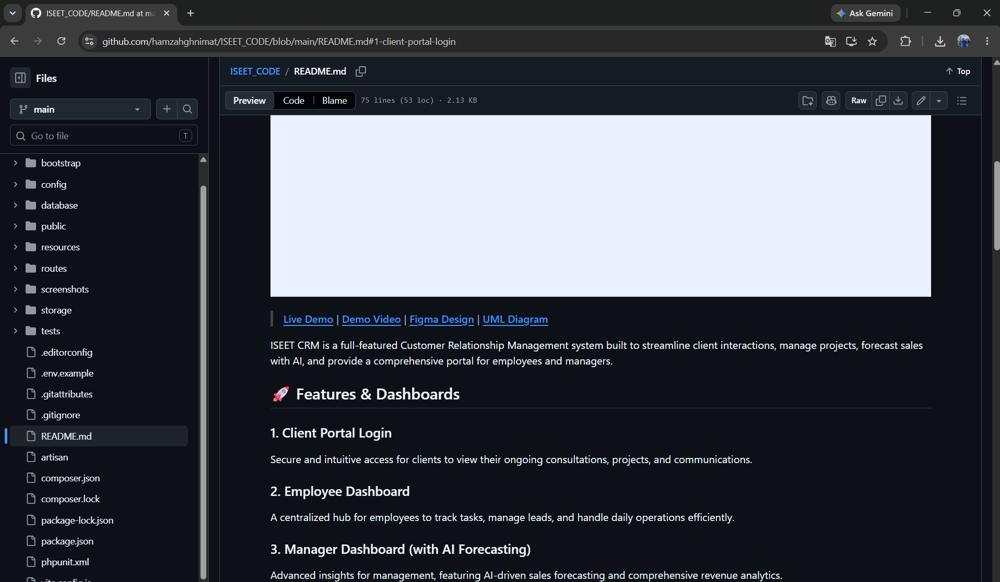

# ISEET CRM



> **[Live Demo](#) | [Demo Video](https://drive.google.com/file/d/1jViVPoDjr4wgWuzK9k-8rM7x46AJH1Ju/view) | [Figma Design](https://item-last-70998760.figma.site) | [UML Diagram](https://drive.google.com/file/d/1VR4aobdgEnU9nnezCuUuVIGqVCiNu86V/view?usp=drive_link)**

ISEET CRM is a full-featured Customer Relationship Management system built to streamline client interactions, manage projects, forecast sales with AI, and provide a comprehensive portal for employees and managers.

## 🚀 Features & Dashboards

### 1. Client Portal Login
Secure and intuitive access for clients to view their ongoing consultations, projects, and communications.


### 2. Employee Dashboard
A centralized hub for employees to track tasks, manage leads, and handle daily operations efficiently.


### 3. Manager Dashboard (with AI Forecasting)
Advanced insights for management, featuring AI-driven sales forecasting and comprehensive revenue analytics.


### 4. Booking Flow
Seamless scheduling for consultations and meetings directly through the platform.


### 5. Admin Approval Screen
Robust administrative controls for approving new accounts, projects, and critical system changes.


---

## 💻 Tech Stack

- **Frontend:** HTML, Vanilla CSS (Custom Design System), JavaScript, Vite
- **Backend:** PHP, Laravel 11.x
- **Database:** SQLite / MySQL
- **Architecture:** MVC Pattern

---

## 🛠 Setup Instructions

1. **Clone the repository:**
   ```bash
   git clone https://github.com/yourusername/iseet-crm.git
   cd iseet-crm
   ```

2. **Install Dependencies:**
   ```bash
   composer install
   npm install
   ```

3. **Environment Setup:**
   ```bash
   cp .env.example .env
   php artisan key:generate
   ```

4. **Database Migrations:**
   ```bash
   php artisan migrate --seed
   ```

5. **Run the Application:**
   ```bash
   # Terminal 1: Run the backend server
   php artisan serve

   # Terminal 2: Run the Vite frontend bundler
   npm run dev
   ```

The application will be available at `http://localhost:8000`.

---
*Note: Make sure to place the newly taken screenshots into the `screenshots/` directory with the names referenced above (e.g., `client-portal-login.png`, `employee-dashboard.png`, `admin-approval.png`).*
